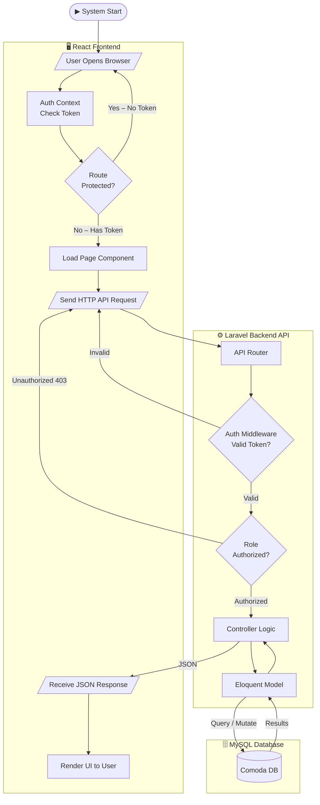
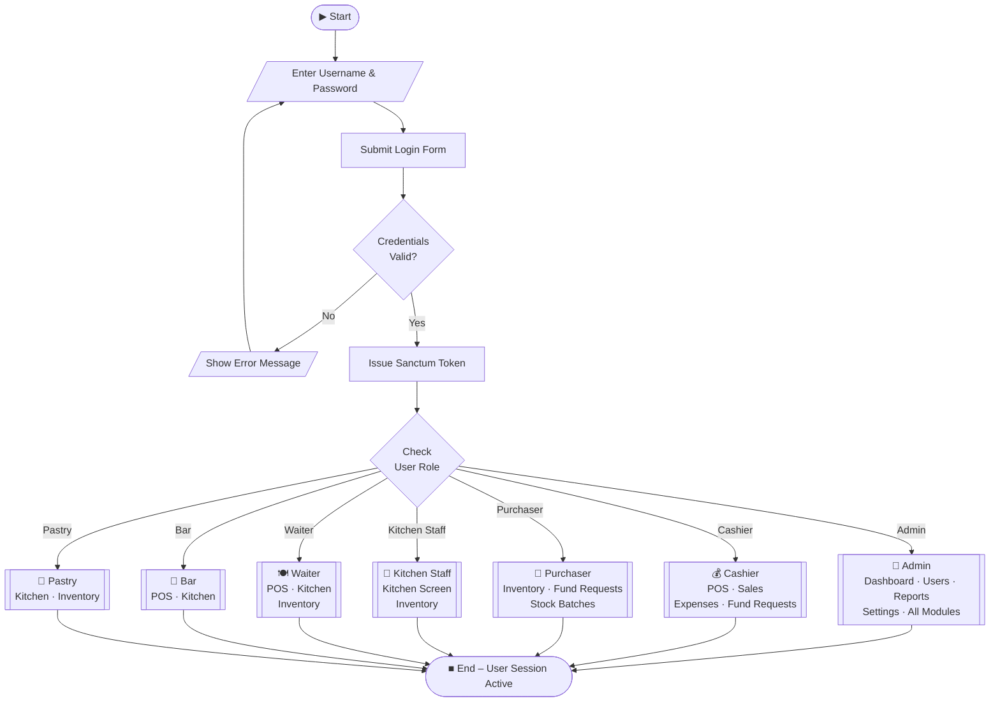
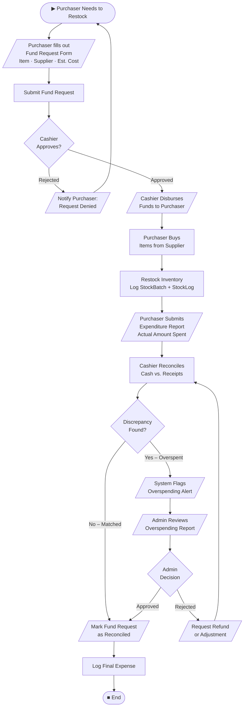
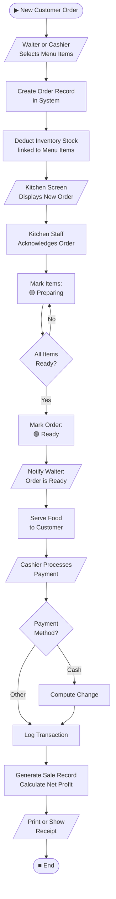
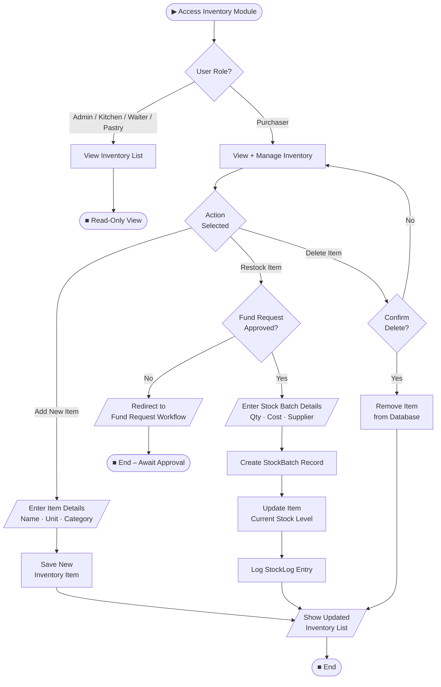
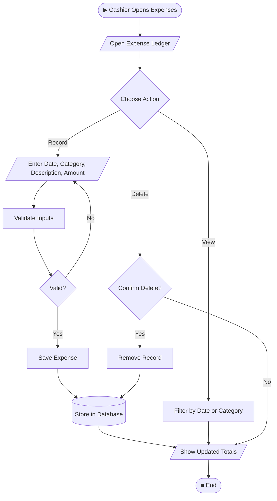
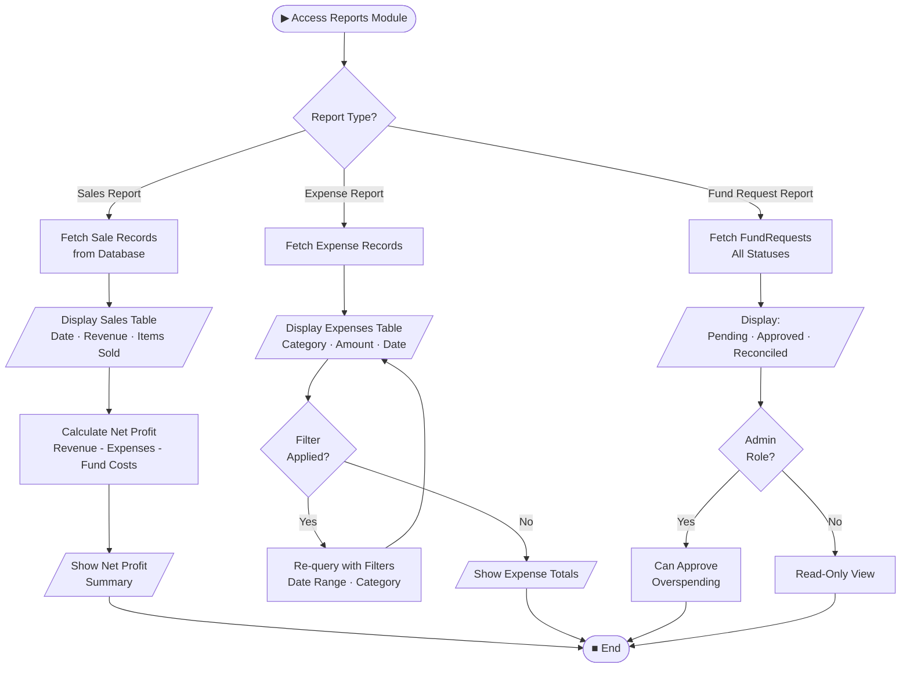

# Management System Flowchart

> **Shape Legend** used in all diagrams below:
>
> | Shape | Mermaid Syntax | Meaning |
> |---|---|---|
> | `([...])` | Stadium/Pill | **Start / End** (Terminal) |
> | `[...]` | Rectangle | **Process** / Action |
> | `{...}` | Diamond | **Decision** (Yes/No) |
> | `[/..../]` | Parallelogram | **Input / Output** |
> | `[(...)` | Cylinder | **Database** |
> | `((...))` | Double Circle | **Actor / User** |
> | `:::` | Subgraph | **Swimlane / System** |

---

## 1. System Architecture & High-Level Data Flow

---

## 2. User Login & Role-Based Access

---

## 3. Purchasing & Fund Reconciliation Workflow

---

## 4. Point of Sale (POS) & Kitchen Workflow

---

## 5. Inventory Management Workflow

---

## 6. Cashier Expenses Workflow

---

## 7. Sales & Expense Reporting Workflow

